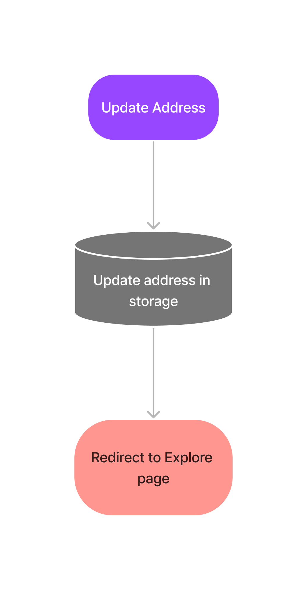
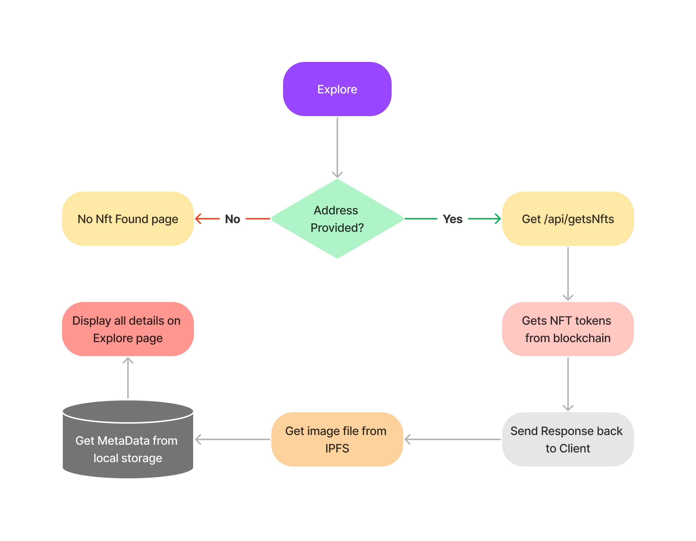
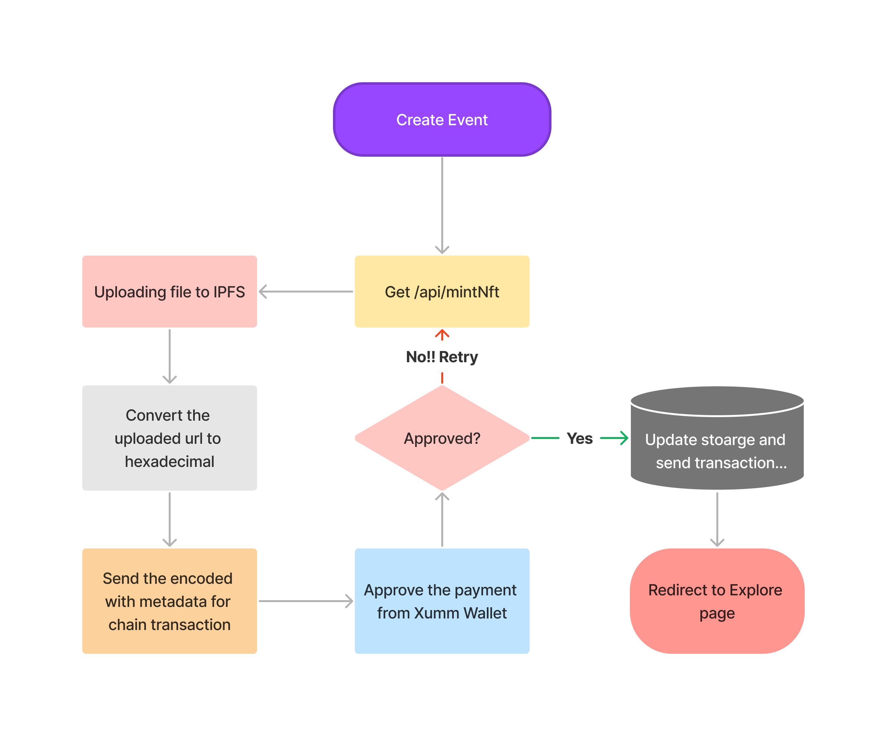
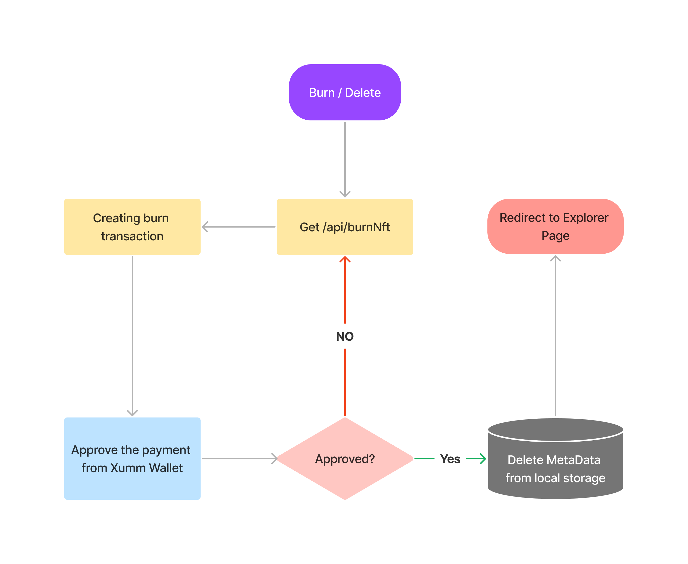
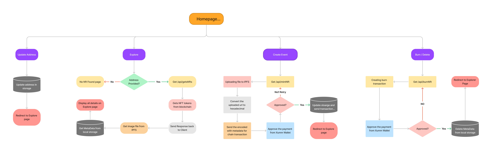

# Xrpl-Eventify

Xrpl-Eventify is a MERN stack application that contains functionality to allow event organizers to mint and distribute Attendance NFTs on the XRP Ledger. The core parts of this application consist of a React frontend, Express backend, **Rest API (nftRoutes.js)**, and **XrplNFTHelper.js**. 


We have used local storage for storing data. we had mongo functions to interact whenever we want to change local storage to mongo.

**XummApi.js**  consists of 11 REST API endpoints and will allow the developer to build on top a marketplace for NFT owners and minters to trade and sell their NFTs utilizing the XUMM Wallet and Pinata IPFS solution. 

## Features implemented :
1. View the latest events.
2. Minting/Creating the events.
3. Cancelling/Burning the events.

### 1. View the latest events.


It fetches the nfts of the user from the blockchain/on chain then from the metadata it gets the **hexadecimal encoded Nft URI** then converts back to human readable uri(which is a ipfs hosted file link) from the **Pinata** IPFS.

### 2. Minting/Creating the events.

Creating events are so easy with Xumm wallet. Once you filled the details, the Qr is shown up.


**Just scan and mint easily**


Once you created the event, you can easily view in explore page

### 3. Cancelling/Burning the events.
Click on Cancel/ Delete event option.


Scan , pay and hurray your event has been deleted.

## Future Plans
1. To store the meta data in json on ipfs or mongo database.
2. Proof of attendance if the user has joined the event or not.
3. Task like twitter like, retweets, and join socials to be incorporated ine the future.

## Lets talk about the architecture
**1. Updating address**  
 <center></center>

 **2. Explore Page**  
 <center></center>

  **3. Mint NFT**  
 <center></center>

   **4. Burn NFT**  
 <center></center>

## Complete Architecture
<center></center>  

## Install and use the developer example

1. Install all packages. Do three npm installs in all three directories. 
```
Xrpl-Eventify/Xrpl-Eventify/ npm install
Xrpl-Eventify/Xrpl-Eventify/backend/ npm install
Xrpl-Eventify/Xrpl-Eventify/frontend npm install

```

2. Run backend then frontend. 

```
../backend/npm start
../frontend/npm start

```
3. Deploying node on prod
```
now --prod
```

# XrpNFTHelper.js
**XrplNFTHelper.js** is Javascript class that is meant to be used within any NodeJS project. It contains functionality that allows event organizers to mint and distribute Attendance NFTs on the XRP Ledger. It is meant to be imported and instantiated inside the routes file of your project.

**Instantiating XrpNFTHelper.js**
Please note, the XrpNFTHelper class has a constructor that takes a javascript object. Before performing a transaction on the ledger certain details are required, depending on the type of transaction (All required paramaters are listed in the comments). These details are passed during the instantiation of XrpNFTHelper class.

```
import XrplNFTHelper from './XrplNFTHelper.js';

router.route('/burnAllNFT').get((req, res) => {

  const nftManager = new XrplNFTHelper({TransactionType: "NFTokenBurn", 
  Account: body.account, 
  Secret:  body.secret,});

  nftManager.burnAllNFT().then( (result) => { return result }) 
  
  })
```


# XrpNFTHelper.js Functions

- mintToken() Mint Single token.
 

   @Params (required class object variables) - created during instantiation of XrpNFTHelper.js
   ```
  TransactionType: this.transactionDetails.TransactionType,
  Account: this.transactionDetails.Account,
  URI: this.transactionDetails.URI,
  Flags: this.transactionDetails.Flags,
  NFTokenTaxon: this.transactionDetails.NFTokenTaxon,
  
  @returns NFTokenID string
   ```
    
   
 

- mintX() Mint any number of tokens with identical info.

  ```

  @Params (required class object variables)
  TransactionType: this.transactionDetails.TransactionType,
  Account: this.transactionDetails.Account,
  URI: this.transactionDetails.URI,
  Flags: this.transactionDetails.Flags,
  NFTokenTaxon: this.transactionDetails.NFTokenTaxon,

  @returns array of NFTokenID strings
  
  ```

- getTokensFromLedger() Get all tokens from the ledger.

```
@Params (required class object variables)

Account: this.transactionDetails.Account

@returns array of NFTokenID's strings
```

- burnNFT() Burn specified NFT.

```

Params (required class object variables): 
          TransactionType: this.transactionDetails.TransactionType,
          Account: this.transactionDetails.Account,
          NFTokenID: this.transactionDetails.NFTokenID

  @Returns: String Transaction Result.
```

- burnAllNFT() Burn all NFTs in the account.
```
  Params (required class object variables): 
  transactionDetails.Secret
  transactionDetails.Account

  @Returns: 
  Array of NFTokenID's for removal of metadata storage

```


# Rest API - nftRoutes.js

The rest API is located at Xrpl-Eventify/backend/routes/nftRoutes.js. 

There are currently 6 GET routes (listed below) that create a class object of XrpNFTHelper.js based on paramaters passed via the body header of a GET request. Each route expects a stringified JSON object. 

For example, in a react front end the /mintNFT route is properly accessed as such:

```
const headers = {'body': JSON.stringify(formData)}

let response = await fetch('/api/mintNFT', {headers})
  setResponse(response)

```


# Rest API Specifications: 

- /api/mintNFT Mints the specified amount of tokens.

```
Expects Stringified JSON object with the following key, value pairs.
*Please note: these are required. Additional metadata can be attached to memo key.

{
  account: String, 
  secret:  String,
  numberOfTokens: String //body header should contain a string that represents an int.
}

@Returns

```


- /burnNFT Burn specified Event token.

```
Expects Stringified JSON object with the following key, value pairs.

{
    account: String, 
    secret:  String,
    nftTokenID: String
}

@Returns
-String (Transaction Result)
```


- /burnAllNFT Burn all NFTs in the account.

```
Expects Stringified JSON object with the following key, value pairs.

{
    account: String, 
    secret:  String,
}

@Returns
Stringified JSON object array with list of removed tokens.


```


- /getTokens Get all NFT's from storage.

```

@Returns Stringified JSON object Array of NFTokenID strings that currently exist in metadata storage


```


- /getTokensFromLedger Get all NFT's from ledger.

```

Expects Stringified JSON object with the following key, value pairs.

{
    account: String
}

@Returns Stringified JSON object Array of NFTokenID strings that currently exist per the ledger


```


- /getData Get all metadata.
```

Expects Stringified JSON object with the following key, value pairs.


  {
    nftTokenID: String
  }


@Returns Stringified JSON object with a memo object containing all details.


```


